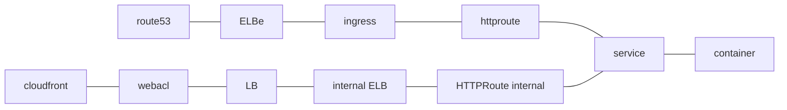

# AWS 2 XML

## Introduction

### Purpose

The goal is to explore the AWS environment and write a swarcdoc XML so it is possible to automatically generate an xml.

### References

- [AWS SDK for Rust Documentation](https://docs.aws.amazon.com/sdk-for-rust/)

## Logging and telemetry

aws2xml prints one line per message to stderr and sends the same message to an OTLP backend.
Start the local backend with `docker compose up -d`, then view logs in Grafana at http://localhost:3000 (Explore, Loki, `service_name="aws2xml"`).

Environment variables:

- `AWS2XML_LOG_LEVEL`: minimum severity, one of `debug`, `info`, `warn`, `error`. Defaults to `info`.
- `OTLP_LOGGING_BACKEND_URL`: OTLP gRPC endpoint for logs. Defaults to `http://localhost:4317`.
- `OTLP_METRICS_BACKEND_URL`: OTLP gRPC endpoint for metrics. Defaults to `http://localhost:4317`.
- `OTLP_TRACE_BACKEND_URL`: OTLP gRPC endpoint for traces. Defaults to `http://localhost:4317`.

With the local compose stack, set the three `OTLP_*` variables to `http://127.0.0.1:4319` (the collector).
[tst_gen.sh](tst_gen.sh) does this for you.

### Traces

Each run produces one trace with the root span `run`.
Every AWS and Kubernetes investigation function has its own child span, tagged with its arguments.
Spans from dependencies such as the AWS SDK are filtered out.

- Log messages appear as events inside the span that produced them.
- Warnings and errors mark their span as failed.
- View traces in Grafana: Explore, Tempo, Search, `service.name = aws2xml`.

## Development

### Adding modules

[Creating a simple application using the AWS SDK for Rust](https://docs.aws.amazon.com/sdk-for-rust/latest/dg/hello.html)

- cargo add aws-config aws-sdk-dynamodb tokio --features tokio/full,aws-config/credentials-login

## Plan

- Get Cloudfront entries
- store them as components in the DB
- dump the db
- if it has a webacl then create a viewpacket and component relation.

### Overview

Access options:

- Get list of route53 zones
  - aws route53 list-hosted-zones
    - aws route53 list-resource-record-sets --hosted-zone-id XXX
      - jq '.ResourceRecordSets[] | select(.Type == "A")' XXX | grep DNSName | sort -u
        - cloudfronts seems to reference cloudfronts owned by AWS
          - aws apigateway get-domain-names --query "items[?distributionDomainName=='REDACTED.cloudfront.net']"
        - execute-api.REGION.amazonaws.com - seems to refer to apigateways
          - aws apigateway get-domain-names
            - aws apigateway get-base-path-mappings --domain-name <domainName>
              - aws apigateway get-rest-api --rest-api-id <restApiId>
          - aws apigatewayv2 get-domain-name
      - Search for '.elb'
        - aws2xml creates one ELB component per hostname and investigates it once per viewpacket.
          - An ELB counts as investigated when the database has an ELB->Gateway or ELB->Ingress relation with the viewpacket's display key.
          - An Ingress backend Service with the label `gateway.networking.k8s.io/gateway-name` is a Gateway. aws2xml follows it into the Gateway's HTTPRoutes (ELB->Ingress->Gateway->Service).
          - `--namespace` filters HTTPRoutes and plain Ingress backends, not the Ingress itself.
        - aws elbv2 describe-load-balancers --query "LoadBalancers[?DNSName=='<DNSName>']"
          - aws elbv2 describe-tags --resource-arns <LoadBalancerArn>
            - ingress.k8s.aws/stack - This tag has an ingress backend.
              - Find the containers in the ingress group
                - kna get ingress -A -o jsonpath='{range .items[?(@.metadata.annotations.alb\.ingress\.kubernetes\.io/group\.name=="<INGRESS_GROUP_NAME>")]}{.metadata.namespace}/{.metadata.name}{"\n"}{end}'
            - service.k8s.aws/stack - this has a gateway backend.
              - These are in Gateway API/Gateways in lenz

- Get a list of all cloudfront entries
  - aws cloudfront list-distributions
    - Origins is where the data is comming from.
    - DomainName is the actual id.
- Get the info on where in k8s the LB is
  - get the ARN for the LB
    - aws elbv2 describe-load-balancers
  - get the tags
    - aws elbv2 describe-tags --resource-arns arn:aws:elasticloadbalancing:REDACTED
    - elbv2.k8s.aws/cluster - the cluster name
      - eks01
    - ingress.k8s.aws/resource or service.k8s.aws/resource - tells you whether an Ingress or a Service created it, and its namespace/name
      - service.k8s.aws/stack = nginx-gateway/internal-nginx
        - nginx-gateway: namespace
        - internal-nginx: deployment
    - ingress.k8s.aws/stack / service.k8s.aws/stack - the namespace/name of the owning object
- aws route53 list-hosted-zones > route53_01_hostzones.json
  - aws route53 list-resource-record-sets --hosted-zone-id 

- aws resourcegroupstaggingapi get-resources --tag-filters Key=gateway.k8s.aws/stack,Values=nginx-gateway/internet-facing
- aws apigateway get-rest-apis > apigateway.json
  - aws apigateway get-resources --rest-api-id REDACTED

#### Overview of ingress vs Gateway

- With an Ingress, you create a Kubernetes Ingress object and the controller provisions an ALB (Layer 7 only).
  - limited to HTTP/HTTPS
- With the Gateway API, you create GatewayClass, Gateway, and route objects (HTTPRoute, GRPCRoute, TCPRoute, UDPRoute)

#### Overview notes

In lens
e.g. look at http routes in the ns, and that are called something with api.

dig 

then look at route53 for the address.

explanation of which gw is used for what.

each nginx-gateway is a lb

#### Map to containers

- kubectl get httproute -A -o json  > http_route.json

- first find the the spec.parentRefs.name and namespace
  - e.g internet-facing and nginx-gateway
  - jq -r '.items[] | select(.spec.rules[].backendRefs[]?.name == "SERVICE_NAME")  | "\(.metadata.namespace)/\(.metadata.name) -> \(.spec.hostnames | join(","))"' pre_http_route.json
  - jq -r '.items[] | select(.spec.rules[].backendRefs[]?.name == "platform")  | "\(.metadata.namespace)/\(.metadata.name) -> \(.spec.hostnames | join(","))"' pre_http_route.json

## TODO

- Also get information to populate the Documentation element.
- Also get sad2md to render the Documentation element.

## Scratchpad

Start with cloudfront
