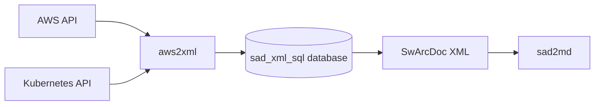
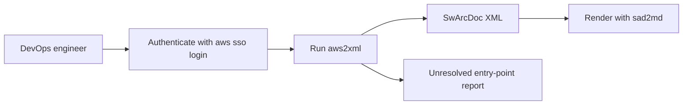

# aws2xml Product Requirements

## Introduction

### Executive summary

aws2xml reads one AWS account and one EKS cluster and generates an ITP SwArcDoc XML file.

The XML holds the Modules, CnC and Allocation viewpackets that describe the deployment.

DevOps engineers use the output to keep an overview of infrastructure that changes faster than manual documentation can follow.

### Purpose

This document defines the product goals, users, features and requirements for aws2xml. The document is the input for the aws2xml design and implementation work.

### Vocabulary

- ALB - Application Load Balancer.
- CnC - Component and Connector viewpacket type.
- EKS - Amazon Elastic Kubernetes Service.
- ELB - Elastic Load Balancer.
- Entry point - A Route 53 record, CloudFront distribution or API Gateway that receives external traffic.
- FIP - Feature Implementation Proposal
- ITP - Idea To Product, the documentation process that defines the SwArcDoc.
- MRD - Marketing Requirement Document.
- Origin - The last component in a request chain, for example a container in EKS.
- SwArcDoc - Software Architecture Document in the ITP XML format.
- Viewpacket - One view of the architecture, for example a CnC ClientServer diagram.
- WAF - AWS Web Application Firewall, attached as a web ACL.

### References

- [aws2xml initial charter](01_initial_charter.md)
- [aws2xml opportunity assessment](02_opportunity_assesmemt.md)
- [AWS SDK for Rust documentation](https://docs.aws.amazon.com/sdk-for-rust/)
- [kube crate documentation](https://docs.rs/kube/)
- [sad2md PRD](../../sad2md/docs/PRD.md)

### Scope

aws2xml covers the following:

- One AWS account and one EKS cluster per run.
- Read-only discovery through the AWS API and the Kubernetes API.
- Modules, CnC and Allocation viewpackets written as SwArcDoc XML.

aws2xml does not cover the following:

- Changes to AWS or Kubernetes resources.
- Several AWS accounts or several EKS clusters in one run.
- Rendering of the XML to Markdown or images. [sad2md](../../sad2md/docs/PRD.md) handles rendering.

### Who is this document for

- Developers who implement aws2xml.
- DevOps engineers who evaluate whether aws2xml solves their documentation problem.
- Reviewers who approve the scope before design starts.

### Overview

LLM-assisted infrastructure work speeds up deployments.

DevOps engineers struggle to keep an overview of what runs in an account and how traffic reaches it. 
Manual architecture documents go stale within weeks.

aws2xml solves this problem by generating the SwArcDoc directly from the live account. Each run traces every entry point to its origin, including into EKS.
The run also records where each component is deployed.

## Market assessment and target demographics

### Goals

- Generate CnC ClientServer viewpackets end-to-end, from each AWS entry point to the origin inside EKS.
- Generate Allocation Deployment viewpackets for all components of the AWS account.
- Generate Allocation Deployment viewpackets for all components of the EKS cluster.
- Generate Modules viewpackets. The content of the Modules viewpacket is an [open question](#open-questions).

### Metrics

#### Clear success metrics

- Every entry point in the account is either traced to an origin or reported as unresolved. No entry point is silently skipped.

#### Key Performance Indicators (KPIs)

- Entry-point coverage - Percentage of entry points that aws2xml traces to an origin. Coverage = traced entry points / all entry points. The baseline and target values are set after the first full run against a reference account.

### User personas

#### DevOps engineer

- Operates the AWS account and the EKS cluster.
- Needs a current overview of how traffic reaches each service.
- Runs aws2xml after infrastructure changes to refresh the SwArcDoc.

#### New team member

- Joins a team with an unfamiliar AWS account.
- Needs to understand the entry points, the request paths and the deployment layout.
- Reads the rendered SwArcDoc instead of browsing the AWS console and Lens.

## Features and User Stories

Features are prioritized as Must or Nice.

| Feature | Priority | User story |
| --- | --- | --- |
| Allocation viewpacket for AWS account | Must | As a new team member, I want to see where each AWS component is deployed, so that I understand the account layout. |
| Allocation viewpacket for EKS cluster | Must | As a DevOps engineer, I want to see where each workload runs in the cluster, so that I can find the impact of a node or namespace change. |
| CnC viewpacket per API Gateway | Must | As a DevOps engineer, I want one diagram per API Gateway, so that I see which backends the API reaches. |
| CnC viewpacket per CloudFront distribution | Must | As a DevOps engineer, I want one diagram per CloudFront distribution, so that I see the WAF, load balancers and origins behind it. |
| CnC viewpacket per Route 53 record | Must | As a DevOps engineer, I want one diagram per Route 53 record, so that I see the full request path from DNS name to container. |
| Modules viewpacket | Must | As a new team member, I want a decomposition view, so that I understand how the system is split into modules. |
| Namespace filter | Nice | As a DevOps engineer, I want to limit the Kubernetes trace to one namespace, so that I can document one product at a time. |
| Unresolved entry-point report | Must | As a DevOps engineer, I want a list of entry points that aws2xml cannot trace, so that I know where the diagrams are incomplete. |

## User Experience (UX)

aws2xml is a command line tool. The user authenticates to AWS, starts aws2xml and receives an XML file.

## Requirements

### Functional Requirements

#### Discovery

- aws2xml shall list every Route 53 hosted zone and record in the account.
- aws2xml shall list every CloudFront distribution in the account.
- aws2xml shall list every API Gateway in the account.
- aws2xml shall follow each entry point through WAF, ELB, Ingress, Gateway, HTTPRoute and Service to the container.
- aws2xml shall investigate each ELB once per viewpacket.

#### Output

- aws2xml shall create one CnC ClientServer viewpacket per Route 53 record.
- aws2xml shall create one CnC ClientServer viewpacket per CloudFront distribution.
- aws2xml shall create one CnC ClientServer viewpacket per API Gateway.
- aws2xml shall create one Allocation Deployment viewpacket for the AWS account.
- aws2xml shall create one Allocation Deployment viewpacket for the EKS cluster.
- aws2xml shall create Modules viewpackets. The content is an [open question](#open-questions).
- aws2xml shall write the result as SwArcDoc XML through sad_xml_sql.
- aws2xml shall report each entry point that the trace cannot resolve.

#### Operation

- aws2xml shall process one AWS account and one EKS cluster per run.
- aws2xml shall use read-only AWS and Kubernetes permissions.
- aws2xml shall accept a `--namespace` option that limits the Kubernetes trace.
- aws2xml shall print an actionable message when AWS authentication fails or expires.

### Use cases

#### UC-01 Generate CnC viewpacket for a Route 53 record

- Name: Generate CnC viewpacket for a Route 53 record.
- Related requirements: [Discovery](#discovery), [Output](#output).
- Preconditions: The user is authenticated to AWS with read-only access. The user has read-only access to the EKS cluster.
- Goal in context: Document the request path from a DNS name to the origin.
- Successful end conditions: The XML holds one CnC ClientServer viewpacket for the record, with every component down to the origin.
- Failed end conditions: The record is listed in the unresolved entry-point report.
- Primary actor(s): DevOps engineer.
- Secondary actor(s): AWS API, Kubernetes API.
- Trigger: The user runs aws2xml.
- Included Use Cases: None.
- Frequency of use: After each infrastructure change.
- Main flow:
  - step 1: aws2xml lists the hosted zones and records.
  - step 2: aws2xml resolves the record target, for example CloudFront, API Gateway or ELB.
  - step 3: aws2xml follows the target through ELB, Ingress or Gateway, HTTPRoute and Service to the container.
  - step 4: aws2xml stores the components and relations in the viewpacket.
- Exceptions:
  - step 2 exception: The target is unknown. aws2xml adds the record to the unresolved report.
  - step 3 exception: The ELB is already investigated in this viewpacket. aws2xml reuses the stored relations.
- Priority: Must.
- Business rules: Each ELB is investigated once per viewpacket.
- Special requirements: Read-only access.
- Assumptions: The ELB tags identify the owning Ingress or Service.
- Notes and issues: None.

#### UC-02 Generate CnC viewpacket for a CloudFront distribution

- Name: Generate CnC viewpacket for a CloudFront distribution.
- Related requirements: [Discovery](#discovery), [Output](#output).
- Preconditions: Same as [UC-01](#uc-01-generate-cnc-viewpacket-for-a-route-53-record).
- Goal in context: Document the request path from a CloudFront distribution to its origins.
- Successful end conditions: The XML holds one CnC ClientServer viewpacket for the distribution, including the WAF web ACL when present.
- Failed end conditions: The distribution is listed in the unresolved entry-point report.
- Primary actor(s): DevOps engineer.
- Secondary actor(s): AWS API, Kubernetes API.
- Trigger: The user runs aws2xml.
- Included Use Cases: None.
- Frequency of use: After each infrastructure change.
- Main flow:
  - step 1: aws2xml lists the CloudFront distributions.
  - step 2: aws2xml records the web ACL and the origins of each distribution.
  - step 3: aws2xml follows each origin to the container, as in UC-01 step 3.
- Exceptions:
  - step 3 exception: The origin is outside the account. aws2xml records the origin as an external component.
- Priority: Must.
- Business rules: Each ELB is investigated once per viewpacket.
- Special requirements: Read-only access.
- Assumptions: None.
- Notes and issues: None.

#### UC-03 Generate CnC viewpacket for an API Gateway

- Name: Generate CnC viewpacket for an API Gateway.
- Related requirements: [Discovery](#discovery), [Output](#output).
- Preconditions: Same as [UC-01](#uc-01-generate-cnc-viewpacket-for-a-route-53-record).
- Goal in context: Document the request path from an API Gateway to its backends.
- Successful end conditions: The XML holds one CnC ClientServer viewpacket for the API Gateway.
- Failed end conditions: The API Gateway is listed in the unresolved entry-point report.
- Primary actor(s): DevOps engineer.
- Secondary actor(s): AWS API, Kubernetes API.
- Trigger: The user runs aws2xml.
- Included Use Cases: None.
- Frequency of use: After each infrastructure change.
- Main flow:
  - step 1: aws2xml lists the API Gateway domain names and REST APIs.
  - step 2: aws2xml resolves the base path mappings and integrations.
  - step 3: aws2xml follows each integration to the backend.
- Exceptions:
  - step 3 exception: The integration type is unsupported. aws2xml adds the API Gateway to the unresolved report.
- Priority: Must.
- Business rules: None.
- Special requirements: Read-only access.
- Assumptions: None.
- Notes and issues: aws2xml covers API Gateway v1 and v2.

#### UC-04 Generate Allocation viewpackets

- Name: Generate Allocation viewpackets.
- Related requirements: [Output](#output).
- Preconditions: Same as [UC-01](#uc-01-generate-cnc-viewpacket-for-a-route-53-record).
- Goal in context: Document where each component of the AWS account and the EKS cluster is deployed.
- Successful end conditions: The XML holds one Allocation Deployment viewpacket for the account and one for the cluster.
- Failed end conditions: aws2xml reports the resource types that it cannot read.
- Primary actor(s): DevOps engineer.
- Secondary actor(s): AWS API, Kubernetes API.
- Trigger: The user runs aws2xml.
- Included Use Cases: None.
- Frequency of use: After each infrastructure change.
- Main flow:
  - step 1: aws2xml lists the account components, for example VPCs, subnets, load balancers and the EKS cluster.
  - step 2: aws2xml lists the cluster components, for example nodes, namespaces and workloads.
  - step 3: aws2xml stores the deployment relations in the viewpackets.
- Exceptions:
  - step 1 exception: A permission is missing. aws2xml reports the missing permission and continues.
- Priority: Must.
- Business rules: None.
- Special requirements: Read-only access.
- Assumptions: None.
- Notes and issues: The full list of AWS resource types is an [open question](#open-questions).

### Open questions

- Content of the Modules viewpacket for an AWS account.
- Full list of AWS resource types in the account Allocation viewpacket.
- Baseline and target values for the entry-point coverage KPI.

## Risks, Constraints and Dependencies

### Constraints

- Implementation language - aws2xml is written in Rust.
- AWS access - aws2xml uses the AWS SDK for Rust crates.
- Kubernetes access - aws2xml uses the kube crate.
- Permissions - aws2xml uses read-only permissions only. Credentials and tokens never appear in the XML or the logs.
- Run scope - One AWS account and one EKS cluster per run.

### Dependencies

- sad2md - Renders the XML to Markdown and diagrams.
- sad_xml_sql - Stores components, relations and viewpackets, and writes the XML.
- AWS CLI - Provides the EKS bearer token through `aws eks get-token`.

### Risks

- Controller conventions - The trace depends on ELB tags set by the AWS Load Balancer Controller. Other controllers break the trace.
- API rate limits - Large accounts can hit AWS API throttling.
- External origins - Origins outside the account cannot be traced further.
- Gateway API variants - New route types such as GRPCRoute, TCPRoute and UDPRoute need extra support.
