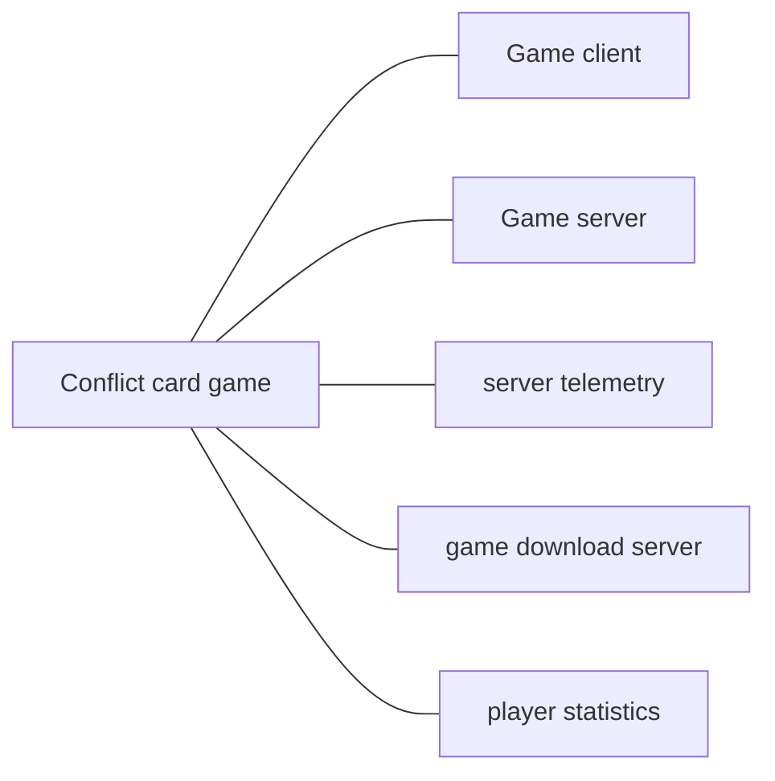
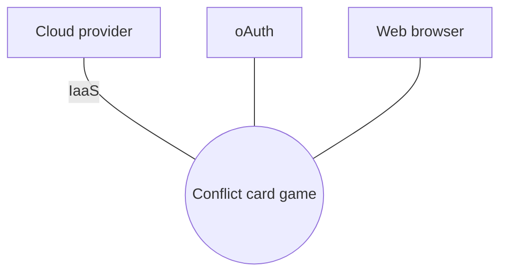
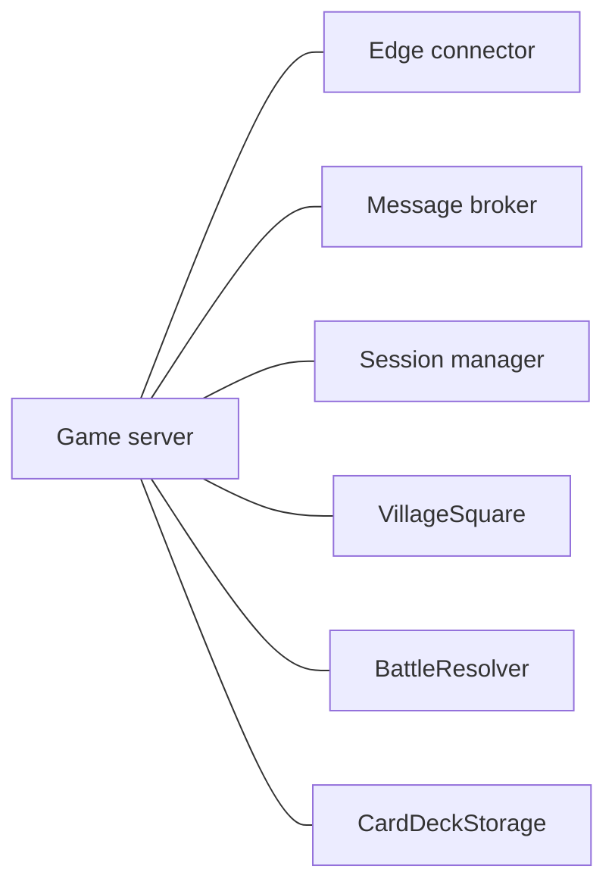
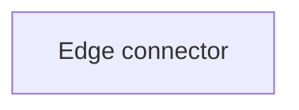
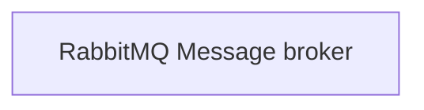
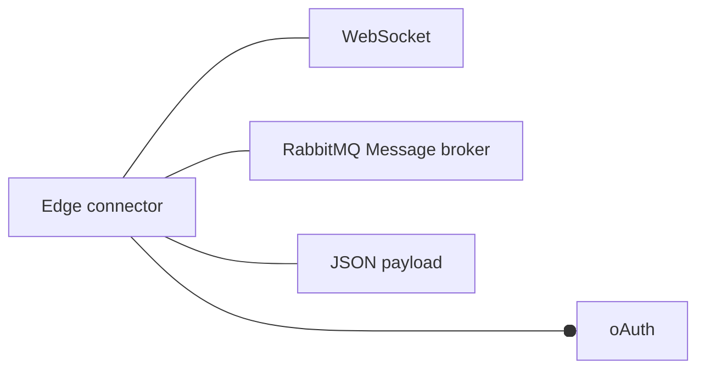
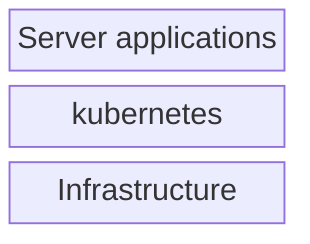
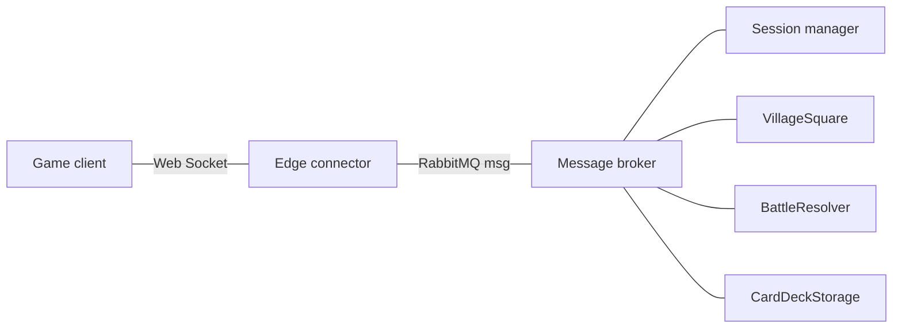
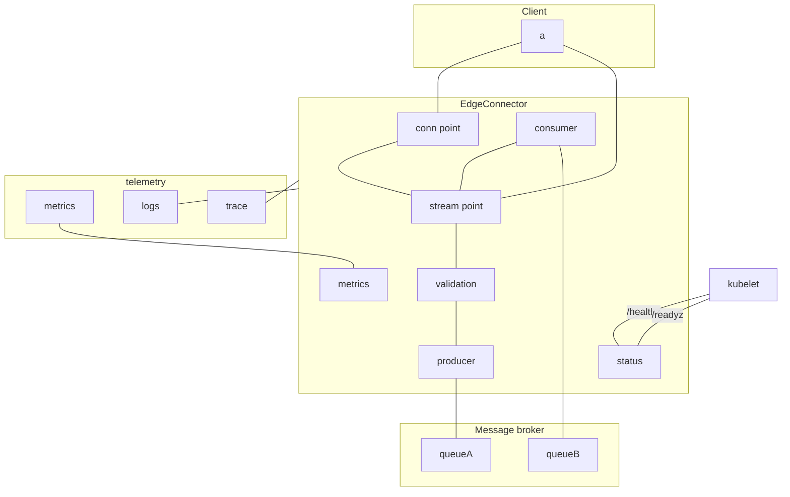

# Software Architecture Document

## Module

### Module Decomposition view packet 1.1.1: Card game

#### 1.1.1: Primary presentation



* Conflict card game: An online multiplayer tournament conflict card game.
  * Game client: Application running at the player end.
  * Game server: The server side solution.
  * server telemetry: Holds the the telemetry of all server side entities.
  * game download server: Hosts the download site for the game client application.
  * player statistics: API with access to all player statistics.

#### 1.1.1: Context diagram



| Entity | Type | Description | Reference |
| ------ | ---- | ----------- | --------- |
| Cloud provider | Adjacent |  |  |
| Conflict card game | TheWork | An online multiplayer tournament conflict card game. |  |
| IaaS | Connector | Iaas operations |  |
| oAuth | Adjacent | authorization that enables a user to grant an application access to their data on another application without sharing their credentials |  |
| Web browser | Adjacent | Web browser application. |  |

#### 1.1.1: Related views

* Parent:
* Siblings:
* Children:
  * [Module Decomposition view packet 1.1.2: Game server](#module-decomposition-view-packet-112-game-server)

### Module Decomposition view packet 1.1.2: Game server

#### 1.1.2: Primary presentation



* Game server: The server side solution.
  * Edge connector: Receive client connections, validate the message and route the message.
  * Message broker: Pub-sub server, enable transferring messages among server services.
  * Session manager: TODO Handle setting up game sessions, and transition the session between the different stations until the game is done.
  * VillageSquare: Modify the deck for the next battle.
  * BattleResolver: Execute the battle
  * CardDeckStorage: Holds the current deck, plus any version of deck still being used in an ongoing session.

#### 1.1.2: Related views

* Parent:
* Siblings:
* Children:
  * [CnC ClientServer view packet 2.1.1: EdgeConnector](#cnc-clientserver-view-packet-211-edgeconnector)
  * [Module Decomposition view packet 1.1.3: Edge connector](#module-decomposition-view-packet-113-edge-connector)
  * [Module Uses view packet 1.2.3: Edge connector](#module-uses-view-packet-123-edge-connector)

### Module Decomposition view packet 1.1.3: Edge connector

#### 1.1.3: Purpose

Ensure the client is authticated and the payload is valid(not a security risk)

#### 1.1.3: Primary presentation



* Edge connector: Receive client connections, validate the message and route the message.
  * Edge connector: Receive client connections, validate the message and route the message.

#### 1.1.3: Related views

* Parent:
  * [Module Decomposition 1.1.2: Game server](#module-decomposition-view-packet-112-game-server)
* Siblings:
  * [CnC ClientServer view packet 2.1.1: EdgeConnector](#cnc-clientserver-view-packet-211-edgeconnector)
  * [Module Uses view packet 1.2.3: Edge connector](#module-uses-view-packet-123-edge-connector)
* Children:

### Module Decomposition view packet 1.1.4: Message broker

#### 1.1.4: Primary presentation



* RabbitMQ Message broker: Pub-sub server, enable transferring messages among server services.
  * RabbitMQ Message broker: Pub-sub server, enable transferring messages among server services.

TODO describe why rabbitMQ was selected as the MessageBroker.

TODO Where to decument the scaling logic?(Is that realy part of the SAD or is that something for the implementation? I think it is an implementation thing.)

TODO where to document the ENV vars? is that also the implementation document? If so it must be written in the implementation document in such a way that The threat model scraper can read the information.

#### 1.1.4: Related views

* Parent:
* Siblings:
* Children:

### Module Uses view packet 1.2.3: Edge connector

#### 1.2.3: Purpose

Ensure the client is authticated and the payload is valid(not a security risk)

#### 1.2.3: Primary presentation

TODO Add uses on the messages being sent into the system, and the subscriber of those messages is also dependent on those messages.



* Edge connector: Receive client connections, validate the message and route the message.
  * WebSocket: WebSocket library for the client application.
  * RabbitMQ Message broker: Pub-sub server, enable transferring messages among server services.
  * oAuth: authorization that enables a user to grant an application access to their data on another application without sharing their credentials
  * JSON payload: JSON message payloads.

#### 1.2.3: Related views

* Parent:
* Siblings:
  * [CnC ClientServer view packet 2.1.1: EdgeConnector](#cnc-clientserver-view-packet-211-edgeconnector)
  * [Module Decomposition view packet 1.1.3: Edge connector](#module-decomposition-view-packet-113-edge-connector)
* Children:
  * [Module Decomposition view packet 1.1.4: Message broker](#module-decomposition-view-packet-114-message-broker)

### Module Layered view packet 1.4.1: Cloud presence layers

#### 1.4.1: Primary presentation



* Server applications: 
* kubernetes: 
* Infrastructure: 

#### 1.4.1: Related views

* Parent:
* Siblings:
* Children:

## CnC

### CnC ClientServer view packet 2.1.1: EdgeConnector

#### 2.1.1: Purpose

Ensure the client is authticated and the payload is valid(not a security risk)

#### 2.1.1: Primary presentation



* Edge connector: Receive client connections, validate the message and route the message.
  * Game client: Application running at the player end.
  * Message broker: Pub-sub server, enable transferring messages among server services.
    * Session manager: TODO Handle setting up game sessions, and transition the session between the different stations until the game is done.
    * VillageSquare: Modify the deck for the next battle.
    * BattleResolver: Execute the battle
    * CardDeckStorage: Holds the current deck, plus any version of deck still being used in an ongoing session.
* Connectors:
  * RabbitMQ msg: 
  * Web Socket: Web Socket stream

#### 2.1.1: Context diagram

```mermaid
  graph TD;
```

| Entity | Type | Description | Reference |
| ------ | ---- | ----------- | --------- |
| Edge connector | TheWork | Receive client connections, validate the message and route the message. |  |

#### 2.1.1: Interfaces



* TODO how to handle authentication?

* outside:
  * client server
    * Connection point - direction: syn, port: 443, protocol: wss, path: /
    * communication point - direction: rw, port: 443, protocol: wss, path: /
* inside
  * container status - direction: ro, port: 80, protocol: http, path: /healthz
    * [Anonymous Authenticator Configuration](https://kubernetes.io/docs/reference/access-authn-authz/authentication/)
  * metrics - direction: ro, port: 9090, protocol: http, path: /metrics
  * to message broker
    * sender
    * receiver
    * TODO get the connection information via ENV?

TODO where is the configuration documented? the install packet?

#### 2.1.1: Protocol

#### 2.1.1: Protocol - Header

* apiVersion
  * v1, v1beta1, v1alpha1
* kind
  * authorize?
  * gamecreate - create a game
  * gamelist - list games
  * gamejoin - join a game
  * gameexit - exit the joined game
  * playeroperation - game move
  * servergameupdate - update since last update
  * servergamestatus - a baseline status.
  * TODO should there exist a single response type of a specific response type?
* sender - uid (0 = server?)
* payload - depend on 'kind'

#### 2.1.1: Protocol - gamecreate

* name: String - 64 octets? (UTF ?)
* private: bool - true
  * Private game
* password: String - 64 octets?
  * Password needed for allowing people to join the game.
    * TODO we need to implement some sort of protection from hacking.
    * TODO also allow creater to kick a player.
* gamemode: String
  * deathmatch
* gametimeminutes: u8
* maxplayer: u8

#### 2.1.1: Protocol - gamejoin

* name: String - 64 octets? (UTF ?)
* password: String - 64 octets?

#### 2.1.1: Requirements

* REQ - Must the received package is safe to send into the system.
  * Description:

| x         |         | x        |        | x           |        |
| --------- | ------- | -------- | ------ | ----------- | ------ |
| State     | Initial | Priority | medium | Criticality | medium |
| Stability |         | Type     |        | PatternType |        |

* REQ - Clients must be authenticated to access the servers.
  * Description:

| x         |         | x        |        | x           |        |
| --------- | ------- | -------- | ------ | ----------- | ------ |
| State     | Initial | Priority | medium | Criticality | medium |
| Stability |         | Type     |        | PatternType |        |

* FIP-PLTF-UNX-RES-211 - CPU needs
  * Description: Specify the CPU needs
  * State: Initial
  * Priority - medium
  * PatternType - 
  * Criticality - medium
  * Stability - unstable
  * Feasibility - todo
  * Difficulty - todo
  * Risk - todo
  * Source - todo
  * Type - todo
  * PatternType - todo
  * Status - draft

#### 2.1.1: Related views

* Parent:
* Siblings:
  * [Module Decomposition view packet 1.1.3: Edge connector](#module-decomposition-view-packet-113-edge-connector)
  * [Module Uses view packet 1.2.3: Edge connector](#module-uses-view-packet-123-edge-connector)
* Children:

## Allocation

