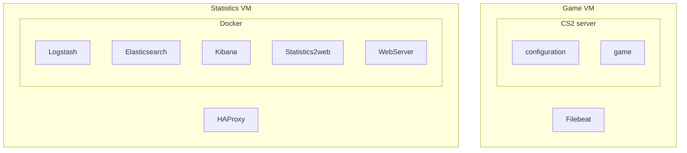
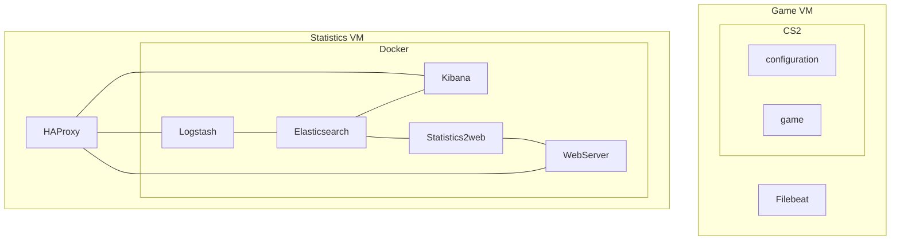

# Draft requirements

- Must be able to convert itp.xml files to SwArcDoc markdown files.
- Must support multiple .xml as input.
- Must support context diagram generation
- Must support MSC generation
- DIAG-FR-008 - Must support deployment diagram generation.
  - Generate graphically
  - Generate textual - alphabetical bullet list.
- XML-FR-008 - Use common xml structure to define diagrams, for both textual and graphical representation.
  - TODO - move this to a common .md since it covers all applications.
  - See #### ComponentRelation - ConnectionType in the ../README.md

#### DIAG-FR-008 - design

I order to generate the diagram all components that are contained by ComponentAlpha, must be listed under the definition of ComponentAlpha

Well-Actually; it looks like I can just add them in any order, and mermaid will handle it, I wonder if gitlab can also render it correctly?
The layout changes though.

Make the textual representation just an usorted list ordered alphabetically.

Un-ordered presentation

